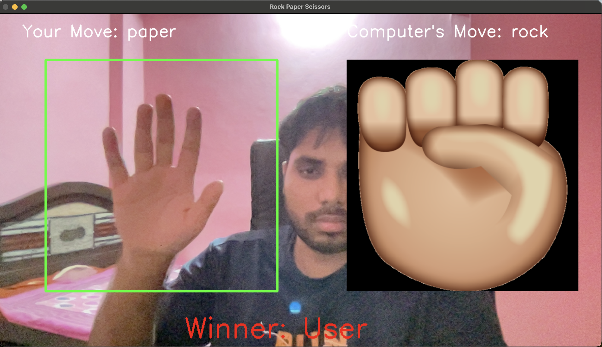

# Rock-paper-scissors-AI-Game
A classic Rock-Paper-Scissors Game using opencv and convolutional neural network

This project is a **Rock Paper Scissors** game using **TensorFlow Lite** for real-time hand gesture recognition via a webcam. The computer randomly selects a move, and the winner is determined based on standard game rules (user move v/s computer move).

---

## 🚀 Features

- 🖐️ **Hand Gesture Recognition** using a pre-trained AI model
- 🎥 **Real-time Video Processing** with OpenCV
- 🤖 **Computer Opponent** makes random moves
- 🎨 **GUI with Move Icons & Score Display**

---

## 📌 Requirements

Ensure you have the following dependencies installed:

- Python 3.9.6 (check runtime.txt)
- OpenCV
- TensorFlow Lite
- NumPy

---

## 🛠️ Installation

1. **Clone the Repository**
   ```sh
   git clone https://github.com/yourusername/rock-paper-scissors-ai.git
   cd rock-paper-scissors-ai
   ```

2. **Create a Virtual Environment** (Recommended)
   ```sh
   python -m venv venv
   source venv/bin/activate   # On macOS/Linux
   venv\Scripts\activate      # On Windows
   ```

3. **Install Dependencies**
   ```sh
   pip install -r requirements.txt
   ```

4. **Download the Model**
   Place your TensorFlow Lite model (`model_stone_paper_scissors.tflite`) in the project directory.

5. **Ensure Images Exist**
   Place `rock.png`, `paper.png`, and `scissors.png` in an `images/` folder inside the project directory if images doesn't exists.

---

## ▶️ Running the Game

Run the following command to start the application:

```sh
python play.py
```

Press `Q` to exit the game.

---

## 🏆 How to Play

1. Position your hand inside the **green-bordered region** displayed on the screen.
2. Make one of the gestures: ✊ (rock), ✋ (paper), ✌️ (scissors).
3. The AI detects your move and randomly selects a move for the computer.
4. The winner is displayed on the screen.

---

## 📸 Preview



---

Happy coding! 🚀

